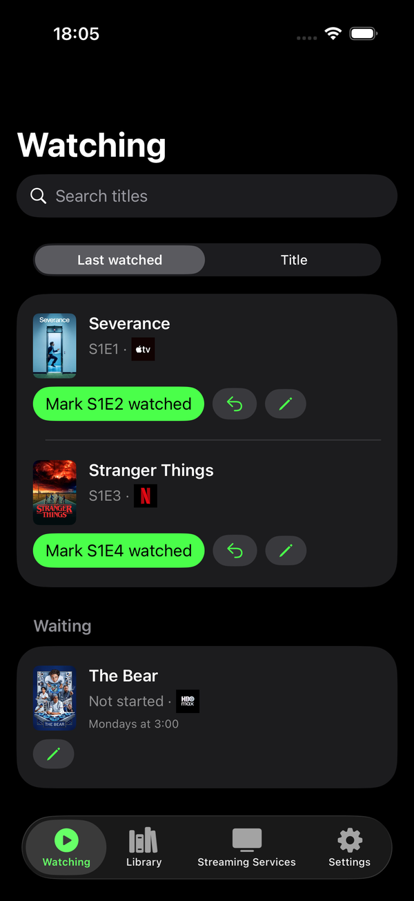
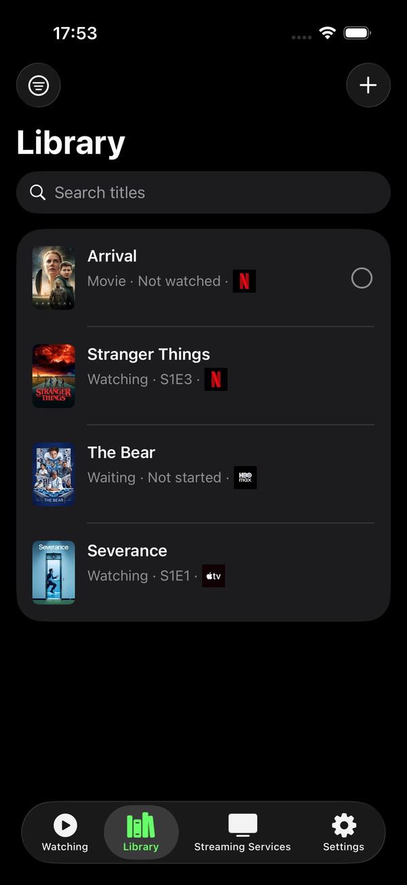
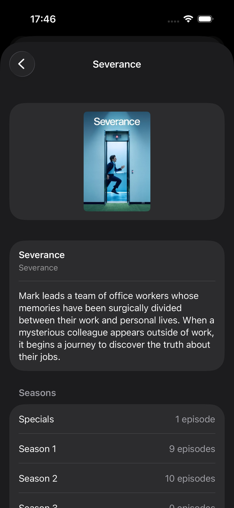
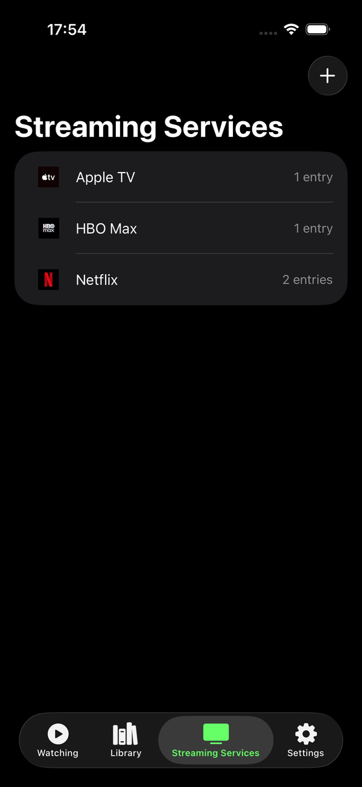

# Season42

An iPhone app for keeping track of which series and movies you watch across streaming services.

Everything the app knows is yours: entered by hand, stored on the device, and never sent anywhere.
There is no account, no sync and no analytics.

**The app works without a network connection.** Your library is on the phone, so opening it,
reading it, editing it, marking an episode watched, reordering what you are watching and looking at
the posters and logos you have already adopted all work with no connection at all — on a plane, in a
tunnel, or with the server switched off for good. **Searching is the one thing that needs a
network**: looking up a series, a movie or a streaming service's logo to enter into your library is
an ask of the internet, and that ask is the only thing that fails offline. Everything you have
already added keeps working.

## Screenshots

<table>
  <tr>
    <td width="25%"></td>
    <td width="25%"></td>
    <td width="25%"></td>
    <td width="25%"></td>
  </tr>
  <tr>
    <td><b>Watching</b> — what is on the go, in an order that is yours and held still, with the next episode one tap away. Below it, what you are waiting on, and when it is due: a series can say it lands Mondays at 3:00 and the row says so rather than counting down.</td>
    <td><b>Library</b> — everything you track, series and movies together, each saying where it stands, what you watch it on, and when the next episode is due.</td>
    <td><b>Search</b> — the one thing that needs a network. What you copy from it is yours to edit; nothing links back.</td>
    <td><b>Streaming Services</b> — the services you have registered, with the logos adopted onto them and how much each one carries.</td>
  </tr>
</table>

Posters and logos are from [TMDB](https://www.themoviedb.org/); the library in these shots is
a handful of entries added to a fresh install.

## You probably want a real tracker instead

**If you are here looking for something to track your watching with, use one of the real ones, not
this.** TMDB has no app of its own, but [their web app](https://www.themoviedb.org/) is the full
catalogue — watchlists, ratings, and it works fine on a phone. On iOS there are proper trackers
built on that same data: [Trakt](https://trakt.tv/) and [Sofa Time](https://www.sofatime.app) among
them. Any of them gives you sync across your devices and people maintaining it. Season42 is one
person's app for one person's habits, and running it means building it yourself.

What this repository is good for is reading. It is a small, complete, deliberately over-documented
project: a SwiftUI app and a server, with the reasoning behind every decision written down next to
the code that implements it. If that is what you came for, the rest of this is for you.

## The two halves

**`app/`** — a SwiftUI iPhone app. Your library lives here and nowhere else, in SwiftData on the
device (ADR-0001, ADR-0005). A series carries its seasons, its episode counts, where you are in it
and one of five statuses you set by hand; a movie carries watched or not. Adding either can start
from a search, but what lands in the library is a copy you own and can edit, not a link back to
someone else's record (ADR-0002).

**`bff/`** — an ASP.NET Core server whose only job is to hold the TMDB access token off the phone
(ADR-0007). It searches TMDB for series, movies and watch providers, and serves the posters and
logos it has fetched. It holds no user data at all, because there is none to hold.

Neither half knows anything about you. The server sees a search text; the phone keeps the result.

## Getting it running

Each half has its own README with the detail. In short:

```sh
# The BFF — needs a TMDB API Read Access Token
cd bff/Season42.Bff
dotnet user-secrets set "Tmdb:AccessToken" "<your token>"
dotnet run                                      # http://localhost:5265

# The tests, from the repo root
dotnet test Season42.slnx

# The app
cd app
xcodebuild -project Season42.xcodeproj -scheme Season42 \
  -destination 'platform=iOS Simulator,name=iPhone 17 Pro' test
```

The app points at the deployed BFF by default, so you can build and run it in the simulator without
running a server at all. To point a build at your own, or to sign for a device, copy
`app/Config/Local.xcconfig.example` to `Local.xcconfig` — it is gitignored — and fill in what is
yours.

**The deployed BFF is rate limited** to 60 requests a minute per caller (ADR-0017). It is one
person's Fly machine with one TMDB token behind it, so please run your own if you are going to do
anything more than look.

- **[`app/README.md`](app/README.md)** — targets, what the build is told, running in the simulator,
  and driving the app with `idb` to reproduce a bug.
- **[`bff/README.md`](bff/README.md)** — configuration, the rate limit, the container, the one-time
  Fly setup, CI, and every endpoint with the answer to each way it can go wrong.

## Finding your way around

Two documents carry the thinking, and they are worth reading before the code:

- **[`CONTEXT.md`](CONTEXT.md)** — the domain language. Every term the code uses in the sense it
  uses it, with the words deliberately avoided. If a name in the code reads oddly, this says why.
- **[`docs/adr/`](docs/adr/)** — the decisions, one file each, in the order they were taken. Code
  comments cite them by number, so an `(ADR-0012)` in a source file is a pointer to the argument
  behind it.

## Requirements

- Xcode recent enough to open the project, with an iOS simulator runtime
- .NET 10 SDK
- A [TMDB](https://www.themoviedb.org/) API Read Access Token, to run the BFF yourself

## How this was built

**All of it, start to finish, was written with Claude Code driven by
[Matt Pocock](https://www.aihero.dev)'s [agent skills](https://github.com/mattpocock/skills).** Not
as an experiment in seeing what an AI would produce unsupervised — as an actual workflow, which is
the part worth passing on. His skills are what gave the work its shape: `/to-spec` and `/to-tickets`
turned an idea into a GitHub issue worth implementing, `/grill-with-docs` took apart the ones that
were not ready, `/tdd` meant a failing test came before every feature, `/domain-modeling` is why
`CONTEXT.md` and `docs/adr/` exist at all, `/implement` did the work, and `/code-review` read it
back afterwards.

That last point is the one that shows in this repository. The reason every decision here has an ADR
with the argument in it, and the reason the comments explain *why* rather than *what*, is that the
workflow kept asking for it. **Plug-and-play, not vibe coding** is how Matt describes the skills,
and the difference is visible in the diff: specs before code, tests before implementation, and the
reasoning written down where the next person — or the next agent — will find it.

If you want the workflow rather than the app, start with [aihero.dev](https://www.aihero.dev) and
the [skills repository](https://github.com/mattpocock/skills). Thank you, Matt.

## Attribution

This product uses the TMDB API but is not endorsed or certified by TMDB. Series and movie data,
posters and streaming service logos all come from [TMDB](https://www.themoviedb.org/).

## License

[MIT](LICENSE). Do what you like with the code; the TMDB data it fetches is TMDB's and comes with
their terms.
